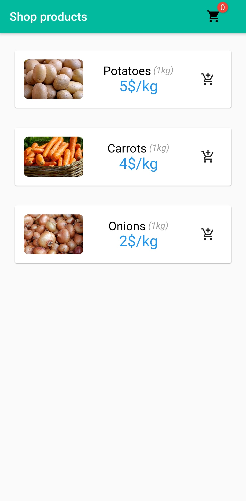
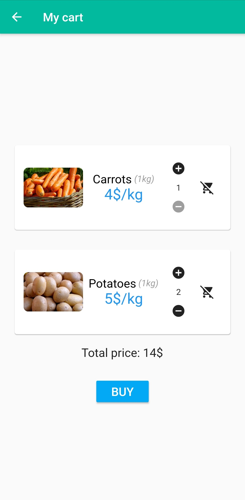

# Shop App

Shop App is a flutter app that displays a products catalog and manages a shopping cart.

## Screenshots

 

## Usage

### Step 1:

Download or clone this repo by using the link below:

```bash
https://github.com/Nahani/flutter-shop-app.git
```

### Step 2:

Go to project root and execute the following command in console to get the required dependencies:

```bash
flutter pub get
```

### Step 3:

Run the app on the device of your choice (web/android/ios)

```bash
flutter run -d <deviceId>
```

## Tests

Run tests:

```bash
flutter test
```

## Contributing

Pull requests are welcome. For major changes, please open an issue first to discuss what you would like to change.

Please make sure to update tests as appropriate.

## License

[MIT](https://choosealicense.com/licenses/mit/)
